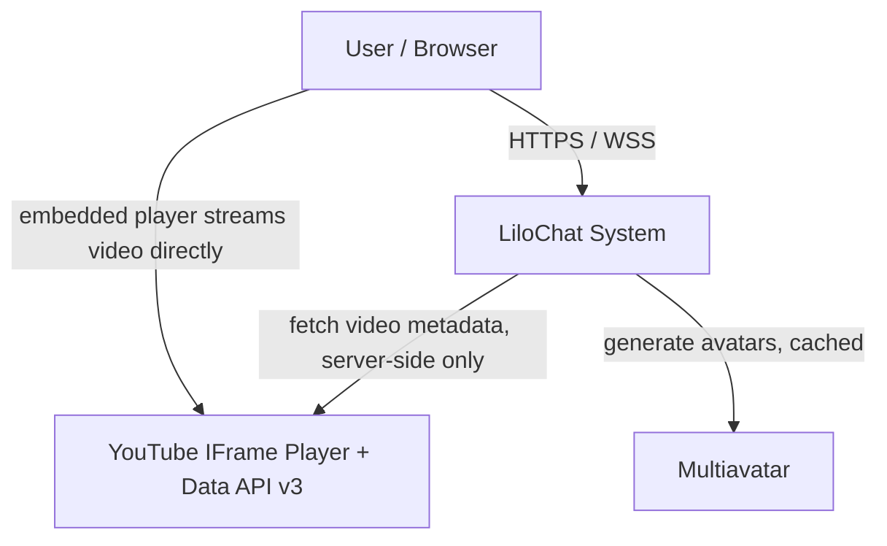
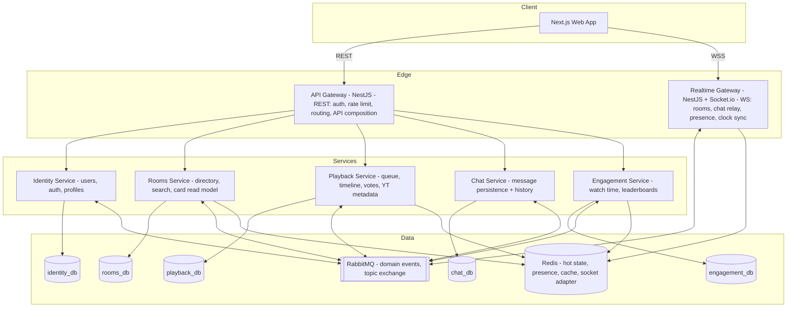
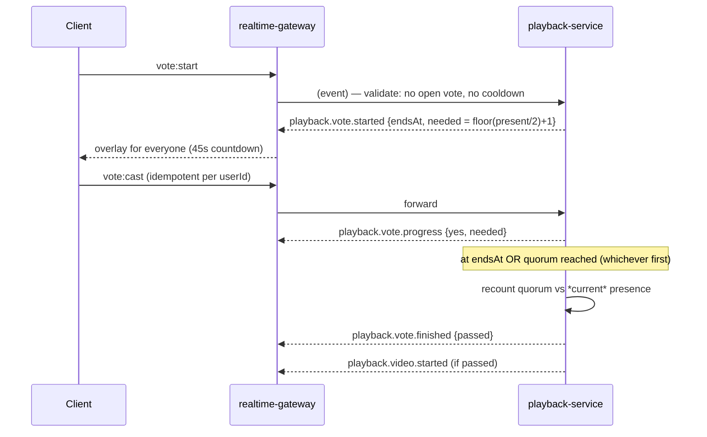

# LiloChat — Architecture Plan & Engineering Guide

> **What this file is.** The single source of truth for LiloChat's architecture, product scope,
> design system, and engineering conventions. Claude Code reads this on every session; humans
> (including recruiters and interviewers) read it to understand how and _why_ the system is built
> this way. Keep it updated when decisions change — every significant change gets an ADR in `docs/adr/`.

---

## 1. Vision & Goals

**LiloChat** is a real-time "watch together" platform: public rooms where people watch YouTube
videos in perfect sync, chat, build a shared queue, and vote to skip. Nobody can pause — the room
has its own timeline, like a TV channel curated by its users.

This project has two explicit, equally important goals:

1. **Production** — a real deployed product with real users, operated with production discipline
   (SLOs, observability, backups, CI/CD).
2. **Portfolio** — a demonstration of senior-level software architecture skills targeted at remote
   international positions. Every architectural decision is documented with its trade-offs, the
   way a senior engineer would defend it in a design review.

**Honest framing (ADR-001):** at launch scale, LiloChat does _not_ need microservices — a modular
monolith would be cheaper and simpler. We deliberately choose microservices because demonstrating
distributed-systems patterns (database-per-service, event-driven choreography, outbox, CQRS read
models, resilience patterns) **is a primary goal of the project**. We accept the operational
overhead consciously, and we keep the service count small (6) to avoid over-engineering beyond
what the goal requires. This trade-off awareness is itself the portfolio point.

### Predecessor (lessons from `lilochat-app-old`)

The first version was a Next.js app coupled directly to Supabase (client-side DB writes, Supabase
Realtime instead of a real backend). What we fix in the rewrite:

| Legacy flaw                                                                                    | Rewrite decision                                                                             |
| ---------------------------------------------------------------------------------------------- | -------------------------------------------------------------------------------------------- |
| Client writes directly to DB; authority (room "king") elected client-side, trivially forgeable | All state changes go through the backend; **the server is the only playback authority**      |
| Sync only on discrete events; no drift correction; magic `setTimeout(600)`                     | Server-authoritative timeline + client clock offset estimation + continuous drift correction |
| Presence had two sources of truth (`users.room_id` column vs realtime presence) → ghost users  | Single source: Redis presence keys with TTL, owned by the realtime gateway                   |
| `.env` committed; YouTube API key hardcoded and exposed via `NEXT_PUBLIC_`                     | Secrets never committed; all third-party calls server-side; key rotation documented          |
| Chat loaded ALL messages then sliced 200                                                       | Cursor-paginated history from day one                                                        |
| Chakra UI + Tailwind mixed; TS/ESLint errors ignored at build (`ignoreBuildErrors`)            | One styling system (Tailwind + shadcn/ui); build fails on type/lint errors, no exceptions    |
| Schema lived only in the Supabase dashboard (not versioned)                                    | Migrations versioned in-repo per service (Prisma/TypeORM migrations)                         |
| Skip voting and ranking never implemented                                                      | First-class features with dedicated flows (§6.4, §6.5)                                       |

---

## 2. Method

This document follows the 4-step system design framework used throughout the reference course
material, extended with two formal practices:

1. **Understand the problem & define scope** → §3 (functional requirements)
2. **Estimate scale & identify bottlenecks** → §4 (NFRs, SLOs, capacity planning)
3. **High-level design: services, APIs & communication** → §5–§7
4. **Tech & infra decisions** → §8–§13

Extensions:

- **ADRs (Architecture Decision Records)** in `docs/adr/` — one per significant decision, with
  context, options considered, decision, and consequences. Index in §15.
- **C4-style diagrams** (Context and Container levels) in Mermaid, kept in this file so they
  render on GitHub.

Vocabulary follows the course canon: API Gateway pattern, BFF, database-per-service, polyglot
persistence, choreography vs orchestration, transactional outbox, CQRS, strong vs eventual
consistency, circuit breaker, retry with exponential backoff + jitter, DLQ, rate limit / token
bucket / admission control, load shedding, bulkhead, cache-aside, SLO/SLI/error budget, RTO/RPO.

---

## 3. Product Scope (Functional Requirements)

### 3.1 Accounts

- Sign up / sign in with email + password. (OAuth Google is a post-MVP milestone, not decorative UI.)
- Profile: nickname (unique, editable), avatar generated deterministically from the nickname via
  Multiavatar. No file uploads in v1.
- Guests can _browse_ the home page; joining a room, chatting, adding videos and voting require an account.

### 3.2 Rooms

- Any user can create a room: name + first YouTube video URL.
- Room page: synced player (left/main), live chat (right), queue + people tabs (under the player).
- **Nobody can pause.** The room timeline advances like a broadcast. No seek, no pause, no
  play — the only controls are personal volume/mute and quality.
- Room directory (home page): infinite-scroll grid of cards. Each card shows the current video
  thumbnail, room name, and live viewer count; **on hover, the card reveals the exact current
  playback time** (computed client-side from the room's `startedAt` — see §6.2) and a progress bar.
- Search rooms by name (debounced).

### 3.3 Queue (playlist)

- Any member can add YouTube videos (URL → server fetches metadata: title, duration, thumbnail).
- Queue is FIFO. When a video ends, the room advances to the next automatically (server-driven).
- Empty queue → room shows an "idle" state prompting members to add videos; if idle for a long
  period (config, default 24h) with zero viewers, the room is archived.
- The video's adder or the room owner can remove a queued (not currently playing) item.
- Duplicate protection: same videoId cannot appear twice in the pending queue.

### 3.4 Skip voting

- Any member can start a "skip current video" vote; while a vote is open, others get an
  overlay/toast to cast their vote (yes only — not voting = no).
- Pass threshold: **> 50% of currently present members** (recomputed at vote resolution).
- Vote window: 45 seconds. On pass → advance queue immediately. On fail → 90s cooldown before a
  new vote for the same video.
- The user who _added_ the current video gets no special veto (equal citizens).

### 3.5 Chat

- Room-scoped real-time chat with Multiavatar avatars and deterministic nickname colors.
- History: cursor-paginated (50 per page), infinite scroll upward.
- Rate limit: 1 message/second per user (token bucket), max 500 chars.
- System messages in-stream: user joined/left, video changed, vote started/passed/failed.

### 3.6 Presence & Ranking

- Live presence list per room (who's watching now).
- **Watch-time ranking**: global leaderboard of accumulated time in rooms (all-time, monthly,
  weekly). Time counts only while connected to a room whose player is actively playing
  ("qualified time" — anti-idle rules can tighten later, documented as an evolution point).
- Leaderboard page + user's own stats on their profile.

### 3.7 Out of scope for v1 (explicitly)

Private rooms, moderation tools beyond basic rate-limiting, DMs, video providers other than
YouTube, mobile apps, room ownership transfer, custom avatars.

---

## 4. Non-Functional Requirements

### 4.1 SLOs (with SLIs)

| Attribute                               | SLI                                                                | SLO (monthly)                |
| --------------------------------------- | ------------------------------------------------------------------ | ---------------------------- |
| Availability (API + WS connect success) | successful requests / total                                        | 99.5% (error budget ≈ 3.6 h) |
| Read latency                            | p95 of GET via gateway                                             | < 300 ms                     |
| Write latency                           | p95 of POST/PATCH via gateway                                      | < 500 ms                     |
| **Playback sync drift**                 | p95 of \|client position − server timeline\| sampled via telemetry | **< 2 s**                    |
| Chat delivery                           | p95 send→broadcast end-to-end                                      | < 500 ms                     |
| Reconnect recovery                      | p95 time to resynced state after WS drop                           | < 5 s                        |

Sync drift is the product-defining SLI — it gets its own Grafana panel and alert.

### 4.2 Disaster recovery

- **RPO**: 5 min for Postgres data (WAL archiving + daily base backup); ≤ 60 s for watch-time
  counters (checkpoint interval); chat/queue Redis hot state is reconstructible.
- **RTO**: 1 h (single-region; documented runbook, restore rehearsed).

### 4.3 Capacity planning (design targets, not fantasies)

Design for a successful-hobby ceiling, with headroom estimated the honest way:

| Metric                              | Target                                                                                    |
| ----------------------------------- | ----------------------------------------------------------------------------------------- |
| Concurrent users                    | 5,000                                                                                     |
| Concurrent rooms                    | 500 (avg 10 users/room, hot room up to 200)                                               |
| Chat throughput                     | peak 2,000 msg/min global; hot room 60 msg/min sustained                                  |
| WS connections per gateway instance | ≤ 5,000 (2+ instances behind LB, Redis adapter)                                           |
| YouTube Data API                    | 10,000 units/day quota → metadata cached permanently per videoId; ~1 unit per _new_ video |

**Identified bottlenecks & mitigations**

1. _Socket fan-out in hot rooms_ → per-user chat rate limit; room summary broadcasts to the lobby
   throttled to 1 per 10 s per room; payloads kept minimal.
2. _YouTube quota_ → cache-aside on video metadata (permanent; metadata is immutable), circuit
   breaker + graceful "metadata pending" degrade.
3. _Presence write volume_ → TTL keys in Redis, heartbeat every 30 s, batched engagement events.
4. _Chat table growth_ → append-only, indexed on `(room_id, created_at)`; monthly partitioning is
   a documented evolution, not a v1 task.

---

## 5. System Architecture

### 5.1 C4 Level 1 — System Context



Key insight: **video bytes never touch our infrastructure.** YouTube serves the stream to each
client's embedded player; we only synchronize _time_ and manage metadata. This is what makes the
product cheap to run.

### 5.2 C4 Level 2 — Containers



### 5.3 Service catalog

| Service              | Responsibility                                                                                                                                                      | Owns (database-per-service)     | Publishes                                                                           | Consumes                                                                             |
| -------------------- | ------------------------------------------------------------------------------------------------------------------------------------------------------------------- | ------------------------------- | ----------------------------------------------------------------------------------- | ------------------------------------------------------------------------------------ |
| **api-gateway**      | Single HTTP entry: JWT validation, token-bucket rate limiting, payload contract validation (zod), routing, **API composition** for room cards, avatar proxy         | — (stateless)                   | —                                                                                   | —                                                                                    |
| **realtime-gateway** | Socket.io termination (scaled via Redis adapter), room membership, presence (TTL keys), chat relay, clock-sync ping/pong, translating domain events → socket events | Redis presence keys             | `presence.*`, `chat.message.submitted`                                              | `playback.*`, `chat.message.persisted`, `engagement.rank.updated`                    |
| **identity**         | Registration, login, JWT issuing (RS256), refresh rotation, profiles                                                                                                | `identity_db`                   | `identity.user.registered`, `identity.user.updated`                                 | —                                                                                    |
| **rooms**            | Room CRUD, directory listing + search, **CQRS read model** of room cards (name, current video, startedAt, viewer count)                                             | `rooms_db` + Redis cache        | `room.created`, `room.archived`                                                     | `playback.video.started`, `presence.user.joined/left`                                |
| **playback**         | Queue management, **server-authoritative timeline**, auto-advance scheduler, skip votes, YouTube metadata (cache-aside)                                             | `playback_db` + Redis hot state | `playback.video.added/started/skipped`, `playback.queue.updated`, `playback.vote.*` | `room.created`, `presence.user.left` (vote quorum)                                   |
| **chat**             | Message persistence, history pagination, profanity hook (later)                                                                                                     | `chat_db`                       | `chat.message.persisted`                                                            | `chat.message.submitted`                                                             |
| **engagement**       | Watch-time accumulation (qualified time), leaderboards (Redis sorted sets + durable Postgres)                                                                       | `engagement_db` + Redis ZSETs   | `engagement.rank.updated`                                                           | `presence.user.joined/left`, `presence.checkpoint`, `playback.video.started/skipped` |

Rules of engagement (course canon):

- Services **never** touch each other's databases. Communication is REST (queries via gateway)
  or events (everything else).
- Inter-service writes are **event-driven choreography** (no orchestrator; all flows here are
  short-lived — the course's own criterion for choosing choreography over saga/orchestration).
- Every event consumer is **idempotent** (dedup by `eventId`).
- Events that must not be lost (chat persistence, watch-time sessions, read-model updates) are
  published via **transactional outbox** (outbox table + polling relay in the same service).

### 5.4 Why each boundary exists (not arbitrary)

- **identity** — different security posture (password hashes, tokens); changes rarely; obvious seam.
- **playback** — the domain core with real invariants (one timeline per room, vote quorum,
  queue consistency). Isolating it keeps the hardest logic testable and lets it scale by CPU/timers.
- **chat** — write-heavy append-only workload with different access patterns (course: polyglot
  persistence thinking, even though both use Postgres — the _schema and scaling_ strategies differ).
- **rooms** — read-intensive directory; a **CQRS read model** fed by events from playback and
  presence, so the home page never queries three services (that aggregation happens at write time,
  not read time).
- **engagement** — pure event consumer; can lag without hurting UX (eventual consistency is fine
  for a leaderboard; the course's canonical example of acceptable eventual consistency).
- **realtime-gateway** — stateful WS termination isolated from stateless HTTP (bulkhead: a socket
  storm can't take down REST; deploy/scale independently).

---

## 6. Core Flows (deep dives)

### 6.1 Domain event catalog

Topic exchange `lilochat.events`, routing key = event name. Envelope:

```ts
interface DomainEvent<T> {
  eventId: string; // uuid v7 — consumer idempotency key
  name: string; // e.g. "playback.video.started"
  occurredAt: string; // ISO, server clock
  version: 1;
  payload: T;
}
```

| Event                      | Payload (essentials)                                               |
| -------------------------- | ------------------------------------------------------------------ |
| `identity.user.registered` | userId, nickname                                                   |
| `identity.user.updated`    | userId, nickname                                                   |
| `room.created`             | roomId, name, ownerId                                              |
| `room.archived`            | roomId                                                             |
| `playback.video.added`     | roomId, itemId, videoId, title, durationS, thumbUrl, addedBy       |
| `playback.video.started`   | roomId, itemId, videoId, title, durationS, thumbUrl, **startedAt** |
| `playback.video.skipped`   | roomId, itemId, reason: `vote \| ended \| removed \| empty`        |
| `playback.queue.updated`   | roomId, queue (ordered summary)                                    |
| `playback.vote.started`    | roomId, voteId, startedBy, endsAt, needed                          |
| `playback.vote.progress`   | roomId, voteId, yes, needed                                        |
| `playback.vote.finished`   | roomId, voteId, passed                                             |
| `chat.message.submitted`   | roomId, tempId, userId, content, sentAt _(from RTG → chat)_        |
| `chat.message.persisted`   | messageId, roomId, userId, nickname, content, createdAt            |
| `presence.user.joined`     | roomId, userId, sessionId, at                                      |
| `presence.user.left`       | roomId, userId, sessionId, at, durationS                           |
| `presence.checkpoint`      | batch of { sessionId, roomId, userId, seconds } _(every 60 s)_     |
| `engagement.rank.updated`  | period, top movers _(throttled)_                                   |

### 6.2 Playback sync — the product core

**Model: server-authoritative broadcast timeline.** Because _nobody can pause_, playback state per
room collapses to a single tuple — this is the key simplification that makes robust sync cheap:

```
Redis hash  room:{id}:playback = { itemId, videoId, durationMs, startedAtMs }   // server clock
position(t) = clamp(t_server − startedAtMs, 0, durationMs)
```

- **Advance**: when a video starts, playback-service enqueues a delayed job (BullMQ) firing at
  `startedAtMs + durationMs + 1500ms grace`. The job pops the next queue item, writes the new
  tuple (Postgres via outbox + Redis), and publishes `playback.video.started`. A skip vote or
  removal cancels/reschedules the job. Single writer per room ⇒ no distributed locking drama
  (jobs keyed by roomId, BullMQ guarantees per-key serialization via job ids).
- **Client clock sync (NTP-style)**: over WS, client sends `sync:ping{clientSentAt}`; server
  replies `sync:pong{serverNow}`. Offset ≈ `serverNow − (clientSentAt + rtt/2)`, smoothed with an
  EWMA over the last 5 samples, re-sampled every 30 s.
- **Drift policy** (client-side, continuous — fixes the legacy app's biggest flaw):
  - |drift| < 1 s → ignore (imperceptible);
  - 1–3 s → **soft correction**: `playbackRate = 1.05` (or 0.95) until caught up — invisible to the user;
  - > 3 s (or after buffering) → hard `seekTo(position)`.
- **Join/refresh**: client fetches room state via REST (`startedAt`, videoId), computes position
  locally, starts the player already at the right second. No "ask the king" round-trip; a page
  reload rejoins in-sync by construction.
- **Autoplay reality**: browsers block unmuted autoplay. The player starts muted with a prominent
  "Tap to unmute" overlay — a deliberate, documented UX decision, not a bug.
- **Embed reality (known limitation)**: YouTube may show a "confirm you're not a bot"
  interstitial to viewers on flagged IPs / cookieless sessions. It is per-viewer, YouTube-side,
  and rare for logged-in users; we mitigate with a declared `origin` and by never seek-storming.
  Accepted trade-off of using the official player (zero streaming cost, full catalog).
- **Telemetry**: clients report sampled drift measurements (1/min) → the sync-drift SLI (§4.1).

The same tuple powers the home page hover feature for free: the card's REST payload includes
`startedAt` + `durationS`, so the exact current time ticks locally with zero extra requests.

### 6.3 Chat flow (write path via events, reads via REST)

```
client ──WS chat:send──► realtime-gateway
  1. rate limit (token bucket, Redis), auth, length check
  2. optimistic broadcast to room  (chat:new, status=pending, tempId)
  3. publish chat.message.submitted
chat-service consumes → persists → publishes chat.message.persisted (outbox)
realtime-gateway consumes → broadcast chat:ack {tempId → messageId}
history: GET /rooms/:id/messages?cursor= (chat-service, keyset pagination)
```

Optimistic broadcast keeps p95 delivery low; the ack path guarantees durability visibility.
If persistence fails (DLQ), the gateway broadcasts a retraction — accepted trade-off, documented.

### 6.4 Skip vote (sequence)



Vote state lives in Redis (`room:{id}:vote`, TTL = window); presence changes during the vote
adjust the quorum at resolution time (leavers don't inflate the denominator).

### 6.5 Presence & ranking pipeline

```
join room (WS) → RTG: SETEX presence:{roomId}:{userId} 75s  + presence.user.joined {sessionId}
heartbeat 30s  → refresh TTL
every 60s      → RTG publishes presence.checkpoint (batched seconds per open session)
disconnect/TTL → presence.user.left {durationS}
engagement     → accumulates qualified seconds (only while room playback active)
                 ZINCRBY leaderboard:{alltime|YYYY-MM|YYYY-Www}  + durable rows (outbox-fed)
```

- One source of truth for presence (Redis TTL keys) — kills the legacy ghost-user bug: a closed
  tab expires in ≤ 75 s and the `left` event fires from a TTL sweep, not from client goodwill.
- Checkpoints bound watch-time loss to ≤ 60 s on crash (the watch-time RPO in §4.2).
- Leaderboard reads are Redis ZSET range queries (O(log N)); Postgres holds durable history for
  monthly resets and profile stats.

---

## 7. API Surface

### 7.1 REST (via api-gateway; versionless path, breaking changes = new resource)

```
POST   /auth/register            {email, password, nickname}
POST   /auth/login               → {accessToken(15m, RS256), refreshToken(30d, rotating, httpOnly)}
POST   /auth/refresh · POST /auth/logout
GET    /users/me · PATCH /users/me {nickname}
GET    /users/me/stats           watch time totals, rank positions
GET    /leaderboard?period=alltime|monthly|weekly&cursor=
GET    /rooms?cursor=&q=         → cards: {id, name, viewers, video:{id,title,thumb,durationS,startedAt}}
POST   /rooms                    {name, firstVideoUrl}
GET    /rooms/:id                full state: playback tuple + queue + viewer summary
POST   /rooms/:id/queue          {videoUrl} → 202 (metadata fetched async if cold)
DELETE /rooms/:id/queue/:itemId  (adder or room owner)
GET    /rooms/:id/messages?cursor=
GET    /avatars/:seed.svg        proxy → Multiavatar, cache-aside (Redis, 30d TTL), circuit breaker
```

`GET /rooms` is **API composition at write time**: the rooms read model is maintained by events,
so this endpoint is one indexed query — cursor (keyset) pagination for React Query infinite scroll.

### 7.2 Socket.io contract

**Namespace `/lobby`** (public): `room:summary` {roomId, name, viewers, video{...startedAt}} — throttled 1/10s/room.

**Namespace `/room`** (JWT on handshake; join = `room:join {roomId}`):

| Direction | Event                                                  | Payload                                      |
| --------- | ------------------------------------------------------ | -------------------------------------------- |
| S→C       | `playback:started`                                     | itemId, videoId, title, durationS, startedAt |
| S→C       | `queue:updated`                                        | ordered queue summary                        |
| S→C       | `chat:new` / `chat:ack` / `chat:retract`               | message / {tempId, messageId} / {tempId}     |
| S→C       | `presence:state` / `presence:joined` / `presence:left` | list / user / user                           |
| S→C       | `vote:started` / `vote:progress` / `vote:finished`     | §6.4 payloads                                |
| C→S       | `chat:send`                                            | {tempId, content}                            |
| C→S       | `vote:start` / `vote:cast`                             | — / {voteId}                                 |
| C→S       | `sync:ping` → S→C `sync:pong`                          | clock sync (§6.2)                            |

Socket event payloads and REST DTOs share **zod schemas in `packages/contracts`** — one contract,
validated at the edge (gateway) and in the client. This is the anti-corruption seam between
frontend and services.

---

## 8. Data Architecture

- **database-per-service** (5 × Postgres 16 logical databases; one physical instance in prod v1,
  split-ready because nothing crosses schemas — documented consciously: shared _server_, never
  shared _schema_).
- **Consistency model**: strong within a service (ACID, single writer per room timeline);
  **eventual** across services (read models, leaderboards) — acceptable staleness budgeted per
  view (room cards ≤ 10 s, leaderboard ≤ 60 s).
- **Outbox tables** in identity/playback/chat/engagement; a relay (interval poll, batch 100,
  at-least-once) publishes to RabbitMQ. Consumers dedup by `eventId` (processed-events table or
  Redis SETNX with TTL).
- **Redis** (single cluster, logical prefixes): socket.io adapter, presence TTL keys, playback hot
  tuples, vote state, rate-limit buckets, avatar & room-card cache (cache-aside), leaderboard ZSETs,
  BullMQ queues.

Schema sketches (per service, owned migrations):

```
identity_db:   users(id, email uq, password_hash, nickname uq, created_at)
               refresh_tokens(id, user_id, token_hash, expires_at, rotated_from)
rooms_db:      rooms(id, name, owner_id, status, created_at)
               room_cards(room_id pk, name, viewers, video_id, video_title, thumb_url,
                          duration_s, started_at, updated_at)        -- CQRS read model
playback_db:   queue_items(id, room_id, video_id, title, duration_s, thumb_url,
                           added_by, position, status: pending|playing|done|skipped)
               videos(video_id pk, title, duration_s, thumb_url, fetched_at)  -- YT metadata cache
               votes(id, room_id, item_id, started_by, ends_at, result)
chat_db:       messages(id, room_id, user_id, nickname, content, created_at)
                 idx (room_id, created_at desc)
engagement_db: watch_sessions(id=session_id, user_id, room_id, started_at, ended_at, seconds)
               user_totals(user_id, period, seconds)  -- upserted from checkpoints
* every service: outbox(event_id, name, payload, created_at, published_at)
```

Note the deliberate denormalization (`nickname` copied into messages/cards): course canon —
materialized-view thinking; profile renames update read models via `identity.user.updated`,
old messages keep the historical nickname (accepted product behavior, cheaper than joins).

---

## 9. Resilience & Security

### 9.1 Resilience (each maps to a course pattern)

| Pattern                                 | Where                                                                                                                                |
| --------------------------------------- | ------------------------------------------------------------------------------------------------------------------------------------ |
| Rate limiting (token bucket, Redis)     | gateway per-IP/per-user; chat 1 msg/s; queue-add 5/min; vote-start cooldown                                                          |
| Load shedding / admission control       | RTG caps connections per instance (5k) and per-room joins (200), sheds with clear client error before saturation                     |
| Circuit breaker (open/closed/half-open) | YouTube Data API, Multiavatar — on open: "metadata pending" degrade / locally generated fallback avatar                              |
| Retry: exponential backoff + jitter     | all event consumers (3 attempts) and inter-service HTTP; idempotency makes retries safe                                              |
| DLQ                                     | per consumer queue; alerted; replay runbook in `docs/runbooks/`                                                                      |
| Bulkhead                                | WS isolated from REST (separate containers); BullMQ scheduler isolated from request path                                             |
| Health checks                           | `/health/live` + `/health/ready` (checks DB/Redis/MQ) on every service                                                               |
| Graceful degradation                    | RabbitMQ down → chat broadcasts continue (persistence catches up from gateway buffer), playback tuple in Redis keeps rooms watchable |

### 9.2 Security

- Passwords: **argon2id**. JWT: **RS256** (services verify with the public key — no shared secret
  fan-out), access 15 min, refresh 30 d rotating + reuse detection (revoke family on reuse).
- WS auth on handshake; room events re-check membership server-side.
- All input validated at the edge with shared zod contracts (gateway = contract firewall; course:
  "errors die at the API").
- Secrets via env / secret store only. **Nothing secret is ever committed** (legacy lesson).
  YouTube key lives only in playback-service. `.env*` gitignored, `.env.example` maintained.
- helmet, strict CORS (exact origins), sanitized chat rendering (no HTML), CSP on the web app.
- Dependency audit in CI (`pnpm audit` + Renovate).

---

## 10. Observability

**Instrumentation is vendor-neutral (OpenTelemetry); the backend is an exporter config, not a
code decision (ADR-011).** Every service ships OTLP to an **OTel Collector** container — the
single pipeline for traces, metrics and logs. Swapping or _adding_ backends (e.g. Datadog) means
editing the Collector's exporter config, nothing else.

- **OpenTelemetry** SDK in every service; W3C `traceparent` propagated through HTTP _and_ RabbitMQ
  message headers (correlated traces across the event bus — the choreography observability answer).
- **Default backend (prod): self-hosted Grafana stack** — Prometheus (metrics), Loki (logs),
  Tempo (traces), Grafana (dashboards/alerts). Zero license cost, runs on the same VPS, and
  operating it is itself portfolio material.
- **Optional backend: Datadog** — a documented Collector exporter block (`datadog:` with API key),
  enabled on demand (trial / demo periods) to produce APM + dashboard evidence with the tooling
  most international teams use. Not always-on in prod (APM ≈ US$31+/host/mo).
- **Metrics**: RED per endpoint/event handler + product metrics: active rooms, concurrent viewers,
  **sync-drift histogram**, vote pass rate, chat msg/s, DLQ depth, outbox lag.
- **Dashboards**: one "SLO" dashboard (the §4.1 table live) + one per service.
- **Logs**: pino structured JSON with traceId → Collector → Loki.
- **Alerts**: error-budget burn rate (fast/slow), DLQ > 0 for 5 min, outbox lag > 30 s, drift p95
  breach, cert expiry.

Dev stack ships in `docker/compose.dev.yml` (Collector + Prometheus + Grafana + Loki + Tempo) so
observability is a first-class local feature, not a prod afterthought.

---

## 11. Frontend Architecture (apps/web)

- **Next.js 15+ (App Router), React 19, TypeScript strict.**
- Server Components for the shell + SEO surfaces (home first page of cards is SSR'd for fast
  paint/social previews); client components for anything live.
- **TanStack Query v5**: `useInfiniteQuery` for room cards (cursor from §7.1) and chat history;
  mutations with optimistic updates. WS events **patch the query cache** (single source of truth —
  no parallel state trees).
- **zustand** only for room-session ephemeral state (player, presence, vote overlay).
- **Player**: thin wrapper over the official **YouTube IFrame Player API** (not react-player —
  we need `playbackRate` drift-nudging and precise `seekTo`; ADR-007). All controls hidden;
  personal volume/mute UI is ours.
- **socket.io-client** in a provider with auth refresh on reconnect and state resync (REST
  snapshot → subscribe → apply) — reconnects must land in-sync (§4.1 reconnect SLO).
- Styling: **Tailwind CSS v4 + shadcn/ui + framer-motion** (one system; no UI-lib mixing — legacy
  lesson). Forms: react-hook-form + zod (same contracts package).
- UI copy in **English** (portfolio audience); i18n-ready structure, pt-BR post-MVP.

## 12. Design System — "Neon Lounge"

Direction: a dark, cinematic "watch together" lounge — Twitch/Discord energy, but warmer and less
cluttered. Significantly more polished than the legacy light-gray UI.

### 12.1 Foundations

- **Color** (Tailwind tokens):
  - Background scale: `zinc-950` page → `zinc-900` surfaces → `zinc-800` raised; 1px `zinc-800`
    borders instead of heavy shadows.
  - **Brand: purple `#9333ea`** (from the logo) → gradient accent `purple-600 → fuchsia-500` for
    primary CTAs and the live glow; `purple-400` for links/focus rings.
  - Semantic: green `emerald-400` (viewer count, success), red `rose-500` (live badge, errors),
    amber `amber-400` (vote countdown, crown/rank gold).
  - Light mode: not in v1 (dark-first product; documented decision).
- **Typography**: **Inter** (variable) everywhere — UI, chat, headings.
  **Luckiest Guy is used exclusively for the "LiloChat" wordmark next to the logo** — nowhere
  else, ever (per product owner).
- **Depth & glow**: subtle `shadow-purple-900/20` glows on live elements; glassy
  `backdrop-blur` on overlays; **no stacked-border shadows** from the legacy design.
- **Motion** (framer-motion, 150–250 ms, ease-out): page fade/slide, card hover lift + glow,
  vote overlay spring-in with countdown ring, presence avatars pop in/out, skeleton shimmer.
  Respect `prefers-reduced-motion`.

### 12.2 Pages

**Home (`/`)** — the storefront:

- Sticky glassy header (`backdrop-blur`, border-b): logo + wordmark (Luckiest Guy) · centered
  search ("Find a room…", debounced) · "Create room" gradient CTA · avatar menu / "Sign in".
- Hero strip (thin): tagline + live counters ("X people watching now") — social proof.
- **Room cards grid** (`sm:2 md:3 xl:4`, infinite scroll with skeletons):
  - Default: 16:9 thumbnail, bottom gradient scrim → room name (semibold) + `● LIVE` rose badge +
    `👥 viewers` emerald pill.
  - **Hover: the card wakes up** — lifts (scale 1.02, purple glow border), scrim deepens, shows
    the current video title, a **ticking exact timestamp `12:34 / 58:00`** (computed locally from
    `startedAt` — updates every second while hovered) and a slim progress bar. No iframe preview
    on hover (legacy autoplayed muted embeds — heavy; deliberate downgrade for performance).
  - Empty/idle room variant: dashed border, "Be the first — add a video".

**Room (`/room/[slug]`)** — the stage (three zones, `lg:` grid `[1fr_380px]`):

- **Player zone**: 16:9, rounded-xl, black; hover reveals _personal_ controls only
  (volume/mute/quality + viewer count). Top-left chip: room name + LIVE. "Tap to unmute" overlay
  on join. Below: current video title + "added by {nick}" + **Vote skip** button with cooldown state.
- **Chat panel** (right, full height): header "Chat" + presence avatar stack (overlapping, +N);
  virtualized message list — Multiavatar 28px, colored nickname, 15px Inter body, timestamps on
  hover, day dividers, system messages as centered muted chips; sticky composer (textarea grows to
  4 lines, Enter sends, char counter near limit) with rate-limit feedback.
- **Under-player tabs**: **Queue** (thumb + title + duration + adder avatar; playing item glows
  purple with an equalizer icon; remove on hover if permitted; "+ Add video" opens modal with URL
  paste → instant preview) · **People** (presence list + session watch time).
- **Vote overlay**: bottom-center floating card, spring-in: "Skip this video? ▷ 4/7" with a
  countdown ring and a big gradient "Vote skip" button; live progress; result toast.
- Mobile: player pinned top, tabs become a bottom sheet, chat fills the rest.

**Leaderboard (`/leaderboard`)**: period tabs (All-time / Monthly / Weekly), top-3 podium with big
avatars and gold/silver/bronze glow, then ranked rows (rank, avatar, nickname, `142h 37m`);
signed-in user's own row pinned/highlighted.

**Auth (modal, per product owner)**: no dedicated auth pages — a dialog opened from the header's
"Sign in" CTA (and from any gated action: join room, chat, vote). Glassy backdrop (`backdrop-blur`
over a dimmed page), centered card (~400px) that animates height and slides horizontally between
the Sign in / Create account panels (framer-motion). Sign-up shows a **live Multiavatar preview**
while the nickname is typed (debounced) — the avatar preview turns sign-up into a toy: small
delight, big conversion. Accessibility: focus trap, Esc closes, gated-action context is preserved
and resumed after auth. Styling is Tailwind-only (no component libraries à la Chakra — the legacy
mistake; shadcn/ui-style copied-in components with Radix primitives for a11y behavior are fine).

---

## 13. Repository, Tooling & Environments

### 13.1 Monorepo (pnpm workspaces + Turborepo)

```
lilochat-app/
├── CLAUDE.md                      # this file
├── apps/
│   ├── web/                       # Next.js
│   ├── api-gateway/               # NestJS (REST edge)
│   ├── realtime-gateway/          # NestJS + Socket.io
│   └── services/
│       ├── identity/ · rooms/ · playback/ · chat/ · engagement/
├── packages/
│   ├── contracts/                 # zod schemas: DTOs, socket events, domain events (SSoT)
│   ├── nest-shared/               # outbox module, idempotent-consumer, otel, health, config
│   └── tooling/                   # eslint config, tsconfig bases
├── docker/
│   ├── compose.dev.yml            # postgres, redis, rabbitmq, observability stack
│   └── compose.prod.yml
├── docs/
│   ├── adr/                       # ADR-001..N (template included)
│   └── runbooks/                  # deploy, restore, DLQ replay
└── .github/workflows/             # ci.yml, deploy.yml
```

Each NestJS service follows a light hexagonal layout (`domain/` pure logic — entities, invariants,
no framework imports; `application/` use cases; `infrastructure/` controllers, repos, MQ). Depth
proportional to domain complexity: full layering in playback/engagement, minimal in identity.

### 13.2 Conventions (enforced, not aspirational)

- TypeScript strict everywhere; **build fails on TS/ESLint errors** (no `ignoreBuildErrors`, ever).
- **All code, comments, commits, docs, ADRs, and UI copy in English.** (Conversation with the
  product owner happens in Portuguese; artifacts are portfolio-facing.)
- Conventional Commits (`feat(playback): …`); PR-sized changes even when solo — the history is
  part of the portfolio.
- Tests colocated (`*.spec.ts`); no skipped tests on main.
- Every service: `Dockerfile` (distroless multi-stage), `/health/*`, graceful shutdown (drain WS,
  finish outbox batch).

### 13.3 Testing strategy (pyramid)

| Layer       | Tooling                                       | Focus                                                                 |
| ----------- | --------------------------------------------- | --------------------------------------------------------------------- |
| Unit        | Vitest                                        | domain logic: timeline math, vote quorum, drift policy, token buckets |
| Integration | Vitest + Testcontainers (pg, redis, rabbitmq) | outbox relay, idempotent consumers, repos                             |
| Contract    | shared zod schemas + generated fixtures       | gateway ⇄ services ⇄ web can't drift                                  |
| E2E         | Playwright (multi-context!)                   | **two browsers in one room: sync within budget, chat, vote skip**     |
| Load        | k6 (WS scenario)                              | 1k sockets/room-set; drift + delivery SLIs under load                 |

The multi-client Playwright sync test is the flagship test of the repo.

### 13.4 Environments & deployment

- **dev**: `docker compose -f docker/compose.dev.yml up` (infra) + `turbo dev` (apps, hot reload).
- **CI** (GitHub Actions): lint → typecheck → unit/integration → build → docker build/push (GHCR),
  affected-only via Turborepo.
- **prod v1**: single VPS (Hetzner CX32-class) — Docker Compose + **Traefik** (TLS, LB across 2×
  realtime-gateway with sticky sessions for Socket.io + Redis adapter). Managed-adjacent Postgres
  discipline: WAL archiving to object storage (§4.2). **Rolling deployment** per service
  (course A68 checklist: two versions may coexist → events are versioned, consumers tolerant).
- **prod v2 (documented evolution, only if scale demands)**: k3s, HPA on gateways,
  canary via Traefik weights. Written as a plan, not built prematurely.
- Feature flags: simple Redis-backed flags read by services (kill switches for chat, votes,
  room creation — cheap insurance for launch).

---

## 14. Delivery Roadmap

Vertical slices — every phase ends deployed and demoable:

| Phase                       | Deliverable (Definition of Done)                                                                                                                  |
| --------------------------- | ------------------------------------------------------------------------------------------------------------------------------------------------- |
| **0. Foundation**           | Monorepo, contracts package, compose.dev (pg/redis/mq/observability), CI green, ADR template + ADR-001..005                                       |
| **1. Identity**             | Register/login/refresh E2E through gateway; auth pages with avatar live-preview; deployed                                                         |
| **2. The Core**             | Rooms + playback + realtime-gateway: create room, add first video, **two browsers watch in sync**; room page v1; flagship Playwright test passing |
| **3. Chat + Presence**      | Live chat with history pagination, presence list, ghost-free counts; home cards live viewers                                                      |
| **4. Queue + Votes**        | Full queue UX, auto-advance, skip voting with overlay; system messages                                                                            |
| **5. Engagement**           | Watch-time pipeline, leaderboard page, profile stats                                                                                              |
| **6. Production hardening** | SLO dashboard live, alerts, load test report, backup/restore rehearsed, security pass, runbooks                                                   |
| **7. Polish & launch**      | Design-system pass (motion, empty states, onboarding), SEO/OG images, landing copy, README with architecture diagrams + demo GIFs                 |

README.md (written in phase 7, drafted from phase 2) is the portfolio front door: hero GIF of two
browsers in sync, C4 diagrams, "architecture highlights" linking into this file and the ADRs.

---

## 15. ADR Index

Format: [MADR](https://adr.github.io/madr/)-style, one file each in `docs/adr/`.

| #   | Decision                                                                                                                                                                                                         | Status   |
| --- | ---------------------------------------------------------------------------------------------------------------------------------------------------------------------------------------------------------------- | -------- |
| 001 | Microservices adopted deliberately for portfolio goals; overhead accepted; 6-service cap                                                                                                                         | Accepted |
| 002 | Event-driven **choreography** over orchestration (short flows, no saga coordinator needed)                                                                                                                       | Accepted |
| 003 | RabbitMQ over Kafka (delivery semantics + DLQ ergonomics fit; Kafka unjustified at this scale — revisit if event replay/streaming needs emerge)                                                                  | Accepted |
| 004 | Server-authoritative no-pause timeline; drift correction via playbackRate nudging                                                                                                                                | Accepted |
| 005 | Transactional outbox + idempotent consumers for cross-service consistency                                                                                                                                        | Accepted |
| 006 | CQRS read model for room directory (write-time composition)                                                                                                                                                      | Accepted |
| 007 | YouTube IFrame API direct (playbackRate control) over react-player                                                                                                                                               | Accepted |
| 008 | Avatars: Multiavatar via server proxy + cache-aside + breaker; **local generation via official npm lib recommended as primary** (same avatars, zero external dependency/rate limits) — final call: product owner | Proposed |
| 009 | Postgres-per-service on one physical instance in v1; split-ready by construction                                                                                                                                 | Accepted |
| 010 | Single-region deployment; multi-AZ deferred (cost); RTO/RPO per §4.2                                                                                                                                             | Accepted |
| 011 | Observability: OTel + Collector pipeline; self-hosted Grafana stack as default backend, Datadog as switchable exporter for demo/interview evidence                                                               | Accepted |

---

## 16. Reference Material

- Course: _Arquitetura de Software & Design de Sistemas Modernos_ —
  `~/Documentos/coding/projects/seniorify/finished_contents/Arquitetura de Software & Design de Sistemas Modernos.md`
- Reference designs (chat ≈ WhatsApp lessons 83–87; video platform ≈ YouTube lessons 103–107):
  `~/Documentos/coding/projects/seniorify/finished_contents/Mastering System Design: From Basics to Cracking Interviews.md`
- Tactical DDD / hexagonal: `~/Documentos/coding/projects/seniorify/finished_contents/Microserviços com Hexagonal Architecture DDD TDD CQRS SOLID.md`
- Legacy app (layout/feature reference only, architecture superseded):
  `~/Documentos/coding/projects/lilochat-app-old`
- Logo: `lilochat-logo.svg` (chat bubble + play, `#9333ea`)
