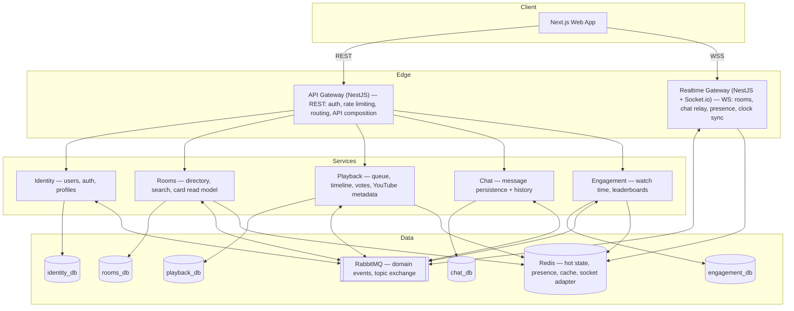

<p align="center">
  
</p>

<h1 align="center">LiloChat</h1>

<p align="center"><strong>Watch YouTube together, in perfect sync.</strong></p>

---

## What is LiloChat

LiloChat is a real-time "watch together" platform: public rooms where people watch YouTube videos
in perfect sync, chat, build a shared queue, and vote to skip. Nobody can pause — each room runs
its own broadcast-style timeline, like a TV channel curated by its users.

The project has two equally important goals: a real deployed product operated with production
discipline (SLOs, observability, backups, CI/CD), and a portfolio-grade demonstration of
distributed-systems architecture where every significant decision is written down with its
trade-offs — including the honest ones (see [ADR-001](docs/adr/001-deliberate-microservices.md)).

## Status: under active development

- [ ] **Phase 0 — Foundation** (monorepo, contracts, dev infra, CI, ADRs) — **in progress**
- [ ] Phase 1 — Identity (auth end-to-end, design system seed)
- [ ] Phase 2 — The Core (rooms, playback, real-time sync — two browsers watching in sync)
- [ ] Phase 3 — Chat + Presence
- [ ] Phase 4 — Queue UX + Skip Votes
- [ ] Phase 5 — Engagement (watch-time leaderboards)
- [ ] Phase 6 — Production Hardening (SLO dashboard, load test, DR rehearsal)
- [ ] Phase 7 — Polish & Launch

Every phase ends deployed and demoable. The step-by-step plan with Definitions of Done lives in
[docs/ROADMAP.md](docs/ROADMAP.md). Demo GIFs and screenshots arrive with Phase 7.

## Architecture at a glance

The key insight: **video bytes never touch our infrastructure.** YouTube streams directly to each
client's embedded player — LiloChat synchronizes _time_ (a server-authoritative timeline with
client-side drift correction) and runs everything social around it.



Highlights, each backed by an ADR: server-authoritative no-pause timeline with `playbackRate`
drift nudging, event-driven choreography with a transactional outbox and idempotent consumers,
a CQRS read model for the room directory, and database-per-service that is split-ready by
construction.

## Stack

| Layer         | Technology                       | Role                                                                  |
| ------------- | -------------------------------- | --------------------------------------------------------------------- |
| Frontend      | Next.js (App Router, TypeScript) | Web app: SSR home, synced player, chat, leaderboards                  |
| Backend       | NestJS                           | API gateway, realtime gateway, five domain services                   |
| Realtime      | Socket.io (Redis adapter)        | WebSockets: rooms, chat, presence, clock sync                         |
| Database      | PostgreSQL                       | Database-per-service (five logical databases)                         |
| Hot state     | Redis                            | Presence TTL keys, playback tuples, caches, leaderboards, rate limits |
| Messaging     | RabbitMQ                         | Domain events over a topic exchange (choreography + outbox)           |
| Observability | OpenTelemetry + Grafana stack    | OTLP → Collector → Prometheus / Loki / Tempo / Grafana                |

## Documentation

- [CLAUDE.md](CLAUDE.md) — the full architecture plan: requirements, SLOs, service catalog, core
  flows, API surface, design system, and conventions. The single source of truth.
- [docs/ROADMAP.md](docs/ROADMAP.md) — the execution roadmap, phase by phase.
- [docs/adr/](docs/adr/) — Architecture Decision Records: every significant decision with its
  context, considered options, and consequences.

## Local development

> Placeholder — firmed up as Phase 0 completes. Requires Node.js (see `.nvmrc`), pnpm, and Docker.

```bash
pnpm install                                   # install workspace dependencies
docker compose -f docker/compose.dev.yml up -d # Postgres, Redis, RabbitMQ (+ observability profile)
turbo dev                                      # run all apps with hot reload
```

---

<p align="center"><sub>Built in the open as a production system and a portfolio piece — the
architecture is documented so it can be defended, not just shipped.</sub></p>
