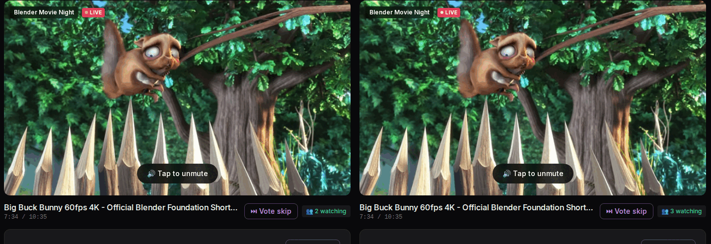
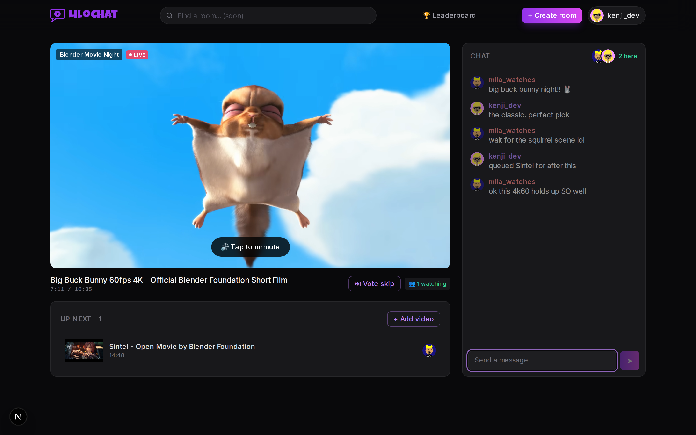
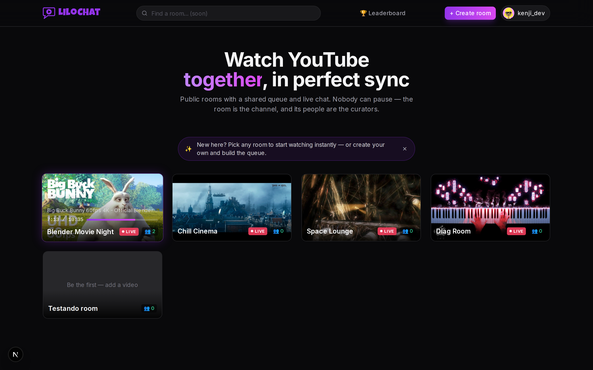
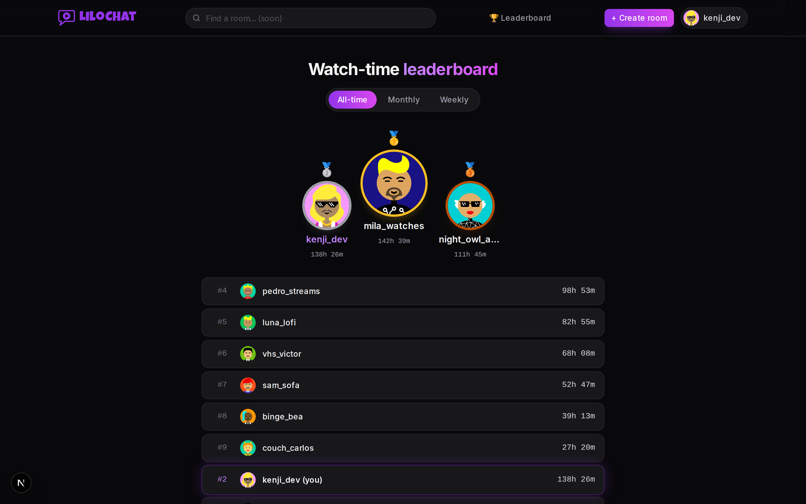
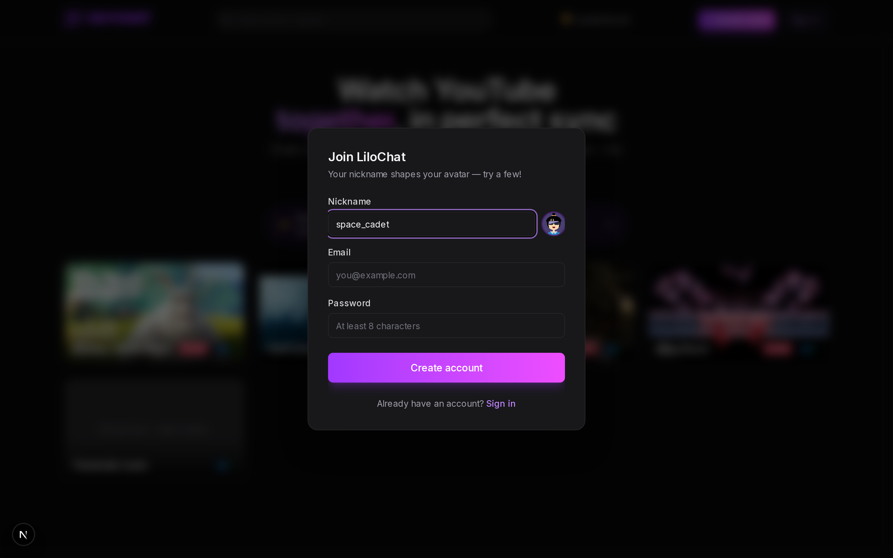
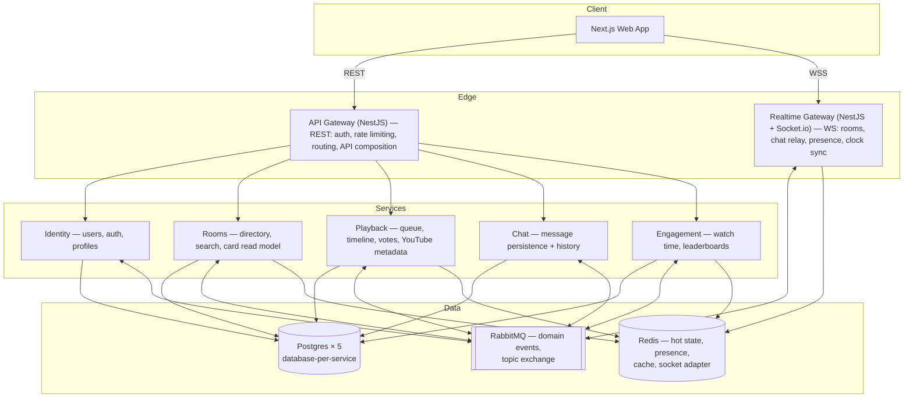

<p align="center">
  
</p>

<h1 align="center">LiloChat</h1>

<p align="center"><strong>Watch YouTube together, in perfect sync.</strong></p>

<p align="center">
  <a href="https://github.com/flaviodorta/lilochat-app/actions/workflows/ci.yml"></a>
</p>

<p align="center">
  
  <br />
  <sub>Two real browsers in one room: same frame, same tick of the server clock. Nobody can pause.</sub>
</p>

---

## What is LiloChat

A real-time "watch together" platform: public rooms where people watch YouTube videos in perfect
sync, chat, build a shared queue, and vote to skip. Nobody can pause — each room runs its own
broadcast-style timeline, like a TV channel curated by its users.

The project has two equally important goals: a real product operated with production discipline
(SLOs, observability, backups, chaos drills, CI/CD), and a portfolio-grade demonstration of
distributed-systems architecture where every significant decision is written down with its
trade-offs — including the honest ones (see
[ADR-001](docs/adr/001-deliberate-microservices.md): at this scale a modular monolith would be
cheaper; the microservices are the point).

## The trick that makes it cheap

**Video bytes never touch our infrastructure.** YouTube streams directly to each client's
embedded player — LiloChat synchronizes _time_, not video. Because nobody can pause, playback
state per room collapses to a single tuple (`videoId`, `startedAt`, `duration`), and every
client's correct position is pure arithmetic:

```
position(t) = clamp(t_server − startedAt, 0, duration)
```

Clients estimate the server clock NTP-style over WebSocket, then continuously self-correct:
drift under 1 s is ignored, 1–3 s is absorbed by nudging `playbackRate` to 1.05/0.95 (invisible),
over 3 s hard-seeks. A page reload lands in sync _by construction_ — there is no state to ask
anyone for. Full design: [CLAUDE.md §6.2](CLAUDE.md).

The flagship test is a Playwright spec that boots the entire backend, opens **two real browsers**
in one room and asserts both stay within the 2-second sync budget through an auto-advance —
plus a 3-browser spec where a skip vote moves everyone at once.

## Screenshots

| The room                                                       | The directory                                                          |
| -------------------------------------------------------------- | ---------------------------------------------------------------------- |
|  |  |

| Watch-time leaderboard                                                      | Auth with live avatar preview                                                     |
| --------------------------------------------------------------------------- | --------------------------------------------------------------------------------- |
|  |  |

## Architecture

Six deliberately-small services behind two gateways, event-driven choreography over RabbitMQ,
database-per-service, Redis for every kind of hot state:



### Highlights — with receipts

Every claim below links to the decision record or the evidence that it actually works:

- **Server-authoritative no-pause timeline** with `playbackRate` drift-nudging
  ([ADR-004](docs/adr/004-server-authoritative-timeline.md)) — the client-side authority of the legacy version was the biggest
  lesson feeding this rewrite.
- **Transactional outbox + idempotent consumers** ([ADR-005](docs/adr/005-transactional-outbox.md)) — effectively-once
  event handling; the kill-the-relay test proves 0 losses, and consumer dedup collapses the
  duplicates.
- **Choreography over orchestration** ([ADR-002](docs/adr/002-event-driven-choreography.md)), **CQRS read model** for the room
  directory ([ADR-006](docs/adr/006-cqrs-room-directory.md)) — the home page is one indexed query, composed at write time.
- **Observability as config, not code** ([ADR-011](docs/adr/011-observability-otel.md)): OpenTelemetry → Collector →
  Grafana/Prometheus/Loki/Tempo, W3C trace context propagated through HTTP _and_ RabbitMQ
  headers, a provisioned SLO dashboard with the sync-drift histogram as the product-defining
  SLI, and file-provisioned alerts (burn rate, DLQ depth, outbox lag, drift p95).
- **[Load test report](docs/load-test-report.md)** — 1,000 sockets across 50 rooms with a chat
  storm 50× the design spec: chat delivery p95 **11 ms** vs a 500 ms SLO, gateway at 10% of one
  core; 2,000 sockets still green.
- **[Degradation drills](docs/degradation-drills.md)** — RabbitMQ killed under chat traffic:
  79/79/79 messages delivered _and_ persisted (bus auto-reconnect + bounded publish buffer were
  built because the first drill failed). Redis killed: the first run crashed the gateway, the
  fixes are in the doc. Honest chaos, receipts included.
- **[DR rehearsal](docs/runbooks/restore.md)** — WAL archiving (5-min RPO by `archive_timeout`),
  nightly base backups, and a scripted, timed restore drill that replays post-backup writes from
  WAL. Plus runbooks for [deploy](docs/runbooks/deploy.md),
  [DLQ replay](docs/runbooks/dlq-replay.md) and
  [secrets rotation](docs/runbooks/secrets-rotation.md) (JWT keypair rotation rehearsed live —
  sessions survive via one silent refresh).
- **[Security pass](docs/security-pass.md)** — 15-item checklist with evidence: argon2id, RS256
  with refresh-family reuse detection, CSP allowlist, layered token buckets, `pnpm audit` clean,
  known/accepted items stated explicitly.

## Stack

| Layer         | Technology                       | Role                                                                     |
| ------------- | -------------------------------- | ------------------------------------------------------------------------ |
| Frontend      | Next.js (App Router, TypeScript) | SSR home, synced player, chat, leaderboards, dynamic OG cards            |
| Backend       | NestJS                           | API gateway, realtime gateway, five domain services (hexagonal-lite)     |
| Realtime      | Socket.io (Redis adapter)        | Rooms, chat, presence, NTP-style clock sync                              |
| Data          | PostgreSQL · Redis · RabbitMQ    | Database-per-service · hot state & caches · domain events (choreography) |
| Observability | OpenTelemetry + Grafana stack    | OTLP → Collector → Prometheus / Loki / Tempo, SLO dashboard + alerts     |
| Testing       | Vitest · Playwright · k6         | Unit/integration per service · multi-browser sync E2E · WS load          |

## Status

Phases 0–6 are complete (foundation → identity → sync core → chat/presence → queue+votes →
engagement → production hardening); Phase 7 (polish & launch) is in progress and the first
public deploy is an owner decision away. The phase-by-phase plan with verified Definitions of
Done lives in [docs/ROADMAP.md](docs/ROADMAP.md).

## Local development

Requires Node 20+, pnpm and Docker.

```bash
pnpm install
docker compose -f docker/compose.dev.yml up -d     # postgres, redis, rabbitmq
node scripts/gen-keys.mjs                          # RS256 keypair → paste into the .env files
# create each app's .env from its .env.example (ports, urls and keys are documented there)
pnpm turbo dev                                     # everything, hot reload

# the full test story
pnpm turbo test                                    # unit
pnpm --filter @lilochat/nest-shared test:int       # integration (real pg/redis/rabbit)
cd apps/web && pnpm exec playwright test           # E2E — boots the whole stack itself

# observability playground
docker compose -f docker/compose.dev.yml --profile obs up -d
OTEL_ENABLED=1 pnpm turbo dev                      # SLO dashboard at localhost:3003
```

## Documentation map

- [CLAUDE.md](CLAUDE.md) — the architecture plan: requirements, SLOs, service catalog, core
  flows, API surface, design system. The single source of truth.
- [docs/ROADMAP.md](docs/ROADMAP.md) — execution roadmap with per-step verification notes.
- [docs/adr/](docs/adr/) — Architecture Decision Records (context, options, consequences).
- [docs/runbooks/](docs/runbooks/) — deploy, restore, DLQ replay, secrets rotation.
- [docs/load-test-report.md](docs/load-test-report.md) ·
  [docs/degradation-drills.md](docs/degradation-drills.md) ·
  [docs/security-pass.md](docs/security-pass.md) — the evidence locker.

---

<p align="center"><sub>Built in the open as a production system and a portfolio piece — the
architecture is documented so it can be defended, not just shipped.</sub></p>
